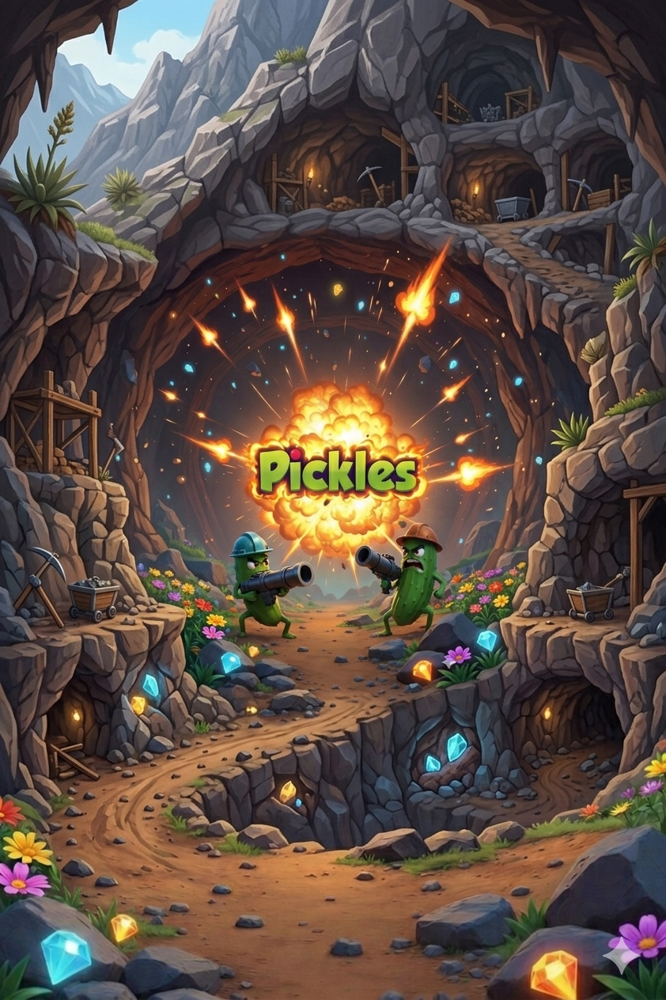

**Pickles** je tahová artilerie inspirovaná herní sérií *Worms*.

## Návod k instalaci

1. **Stáhni Termux**  
   [https://f-droid.org/packages/com.termux/](https://f-droid.org/packages/com.termux/)

2. **Nainstaluj závislosti:**
   ```bash
   pkg update && pkg upgrade -y
   pkg install python -y
   pip install flask-socketio
   ```

3. **Naklonuj repozitář:**
   ```bash
   git clone https://github.com/darkwalkerprime/pickles.git
   cd pickles
   ```

4. **Spusť hru:**
   ```bash
   python app.py
   ```

5. Otevři v prohlížeči:  
   **http://127.0.0.1:5000**

---

**Poznámka**  
*Multiplayer přes P2P zatím nefunguje.* Hra běží lokálně proti AI nebo v režimu hotseat na jednom zařízení.

## Soundtrack

| Typ | Mapa | Název | Autor |
| --- | --- | --- | --- |
| Menu | - | Ambient Epic Cinematic Orchestra | Rockot |
| Mapa | Rezavý víčko | Ambient | The_Mountain |
| Mapa | Okurkovej most | Robotic Dreams | DSTechnician |
| Mapa | Zelnej příkop | Angry Robot III | DSTechnician |
| Mapa | Řepný útesy | Robot | Audioknap |
| Mapa | Arizonskej salát | The Grid Part | pietiX |

Credits:
"Design & Direction: DarkwalkerPrime.
Code: Gemini + Claude".
